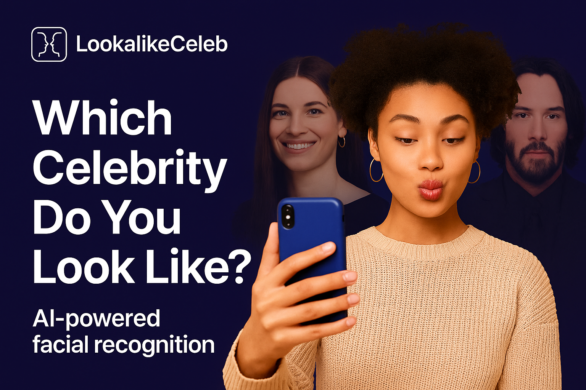

<p align="center">
  
</p>

<h1 align="center">🎬 LookalikeCeleb</h1>
<p align="center"><strong>
  Find your celebrity twin with AI &nbsp;•&nbsp; 100% open‑source &nbsp;•&nbsp; Powered by <a href="https://inference.net">Inference.net</a>
</strong></p>

<p align="center">
  <a href="https://lookalikeceleb.com"></a>
  <a href="https://docs.inference.net/features/vision"></a>
  
  
</p>

---

## 📸 1‑Minute Tour

1. **Upload a selfie** (PNG / JPG or paste / camera).
2. The server calls **Inference.net Vision + LLM** → returns structured JSON of your **top‑3 celebrity matches**.
3. Front‑end fetches hi‑res images for each celeb → renders side‑by‑side cards with share/download buttons.
4. No account, no storage — everything processed in memory.

<br/>

## 🔑 Why This Repo Rocks

| Problem | How LookalikeCeleb Solves It |
|---------|------------------------------|
| Most look‑alike apps are black‑box 🔒 | **Transparent, structured JSON** straight from Inference.net |
| Hard to demo a multimodal LLM quickly | <code>pnpm run dev</code> and you have a full‑stack vision demo |
| Vision APIs return text blobs | We enforce **JSON schema** → typed data in TS + Zod |
| Shareable results are clunky | Built‑in **share card generator** (copy, download, social links) |
| Serverless latency issues | Runs on **Bun + Hono** (fast) • Dockerfile ready • zero vendor lock‑in |

<br/>

## 🧰 Stack

- **Frontend** – Vite • React 18 • shadcn/ui • TailwindCSS  
- **Backend**  – Bun runtime • Hono router • TypeScript end‑to‑end  
- **AI**       – [Inference.net Vision API](https://docs.inference.net/features/vision) + Structured Outputs  
- **Deploy**   – Works on Railway, Vercel, Fly.io, or any Docker host

<br/>

## 🚀 Quick Start

```bash
git clone https://github.com/yourrepo/lookalikeceleb.git
cd lookalikeceleb
pnpm install                 # or bun install / npm i
cp .env.example .env         # add INFERENCE_API_KEY
pnpm run dev                 # frontend at http://localhost:5173
bun run server:index.ts      # backend at http://localhost:3000
````

> **Tip:** in dev, Vite proxy is already configured — uploads hit <code>/api</code> on port 3000.

<br/>

## 🛠️  Nerd‑Level Architecture

```mermaid
flowchart TD
  A[Client<br/>(React)] -- upload --> B(/api/matches<br/>(Hono+Bun))
  B -- Vision prompt --> C[Inference.net<br/>Vision + LLM]
  C -- JSON matches --> B
  B -- fetch img --> D[Y! / Bing Image<br/>Search Proxy]
  B -- merged JSON --> A
```

*B*: includes timeout + retry logic (handles 524s)
*D*: lightweight proxy → base64 (avoids CORS headaches)

<br/>

## ✨ Example Inference Request → Response

<details>
<summary>Click to view</summary>

**Request (truncated)**

```jsonc
POST https://api.inference.net/v1/chat/completions
{
  "model": "google/gemma-3-27b-instruct/bf-16",
  "messages": [
    {"role":"user","content":[
      { "type":"image_url",
        "image_url":{"url":"data:image/jpeg;base64,..." }
      },
      { "type":"text",
        "text":"Find top 3 celebrity look‑alikes with explanation."}
    ]}
  ],
  "response_format":{
    "type":"json_schema",
    "json_schema":{
      "type":"object",
      "properties":{
        "matches":{"type":"array","minItems":3,"maxItems":3,
          "items":{
            "type":"object",
            "properties":{
              "name":{"type":"string"},
              "percentage":{"type":"number"},
              "description":{"type":"string"}
            },
            "required":["name","percentage","description"]
          }
        }
      }
    }
  }
}
```

**Response**

```json
{
  "matches": [
    { "name":"Emma Stone","percentage":94,
      "description":"Wide-set green eyes, pronounced cheekbones…" },
    { "name":"Ryan Gosling","percentage":87,
      "description":"Similar jawline, nose bridge, blue eyes…" },
    { "name":"Zendaya","percentage":82,
      "description":"Matching eyebrow arch, chin profile…" }
  ]
}
```

</details>

<br/>

## 🌐 1‑Click Deploy

| Platform | Button                                                                                                                                          |
| -------- | ----------------------------------------------------------------------------------------------------------------------------------------------- |
| Railway  | [](https://railway.app/new/template?templateUrl=https://github.com/yourrepo/lookalikeceleb) |
| Vercel   | `vercel --prod` works out‑of‑the‑box                                                                                                            |
| Docker   | `docker build -t lookalikeceleb . && docker run -p 3000:3000 lookalikeceleb`                                                                    |

Set `INFERENCE_API_KEY` wherever you deploy.

<br/>

## 🤝 Contributing

1. Fork + star ⭐ (optional but awesome)
2. `git checkout -b my-feature`
3. Commit + PR — we love community ideas (new share templates? dark‑mode face guide? throw it in!)

<br/>

## 📜 License

[MIT](LICENSE)

---

> **Built with love for demos, and showing what multimodal LLMs can do.
> If you launch something with this, ping me — I’d love to see it!**
