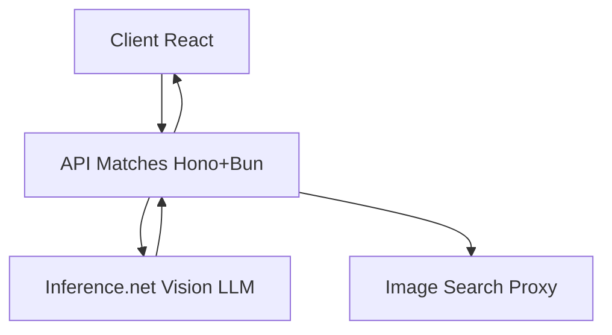

<p align="center">
  
</p>

<h1 align="center">🎬 LookalikeCeleb</h1>
<p align="center"><strong>
  Find your celebrity twin with AI &nbsp;•&nbsp; Open source &nbsp;•&nbsp; Powered by <a href="https://inference.net">Inference.net</a>
</strong></p>

<p align="center">
  <a href="https://lookalikeceleb.com"></a>
  <a href="https://docs.inference.net/features/vision"></a>
  
</p>

---

## 📸 How it works

1. **Upload a photo** (PNG/JPG, paste, or camera)
2. **AI analysis** via Inference.net Vision + LLM returns structured JSON with your top celebrity matches
3. **Results display** with hi-res images, similarity scores, and shareable cards
4. **Privacy-first** - no accounts, no storage, everything processed in memory

<br/>

## 🔧 Features

- **Transparent AI** - structured JSON responses from Inference.net, not black-box results
- **Fast development** - full-stack multimodal demo in minutes with `pnpm run dev`
- **Type-safe** - JSON schema enforcement with TypeScript + Zod validation
- **Share-ready** - built-in card generator for social media (copy, download, platform links)
- **Production-ready** - Bun + Hono backend, Docker support, no vendor lock-in
- **Privacy-focused** - optional analytics, no data storage

<br/>

## 🧰 Tech Stack

- **Frontend** – Vite • React 18 • shadcn/ui • TailwindCSS  
- **Backend**  – Bun runtime • Hono router • TypeScript end‑to‑end  
- **AI**       – [Inference.net Vision API](https://docs.inference.net/features/vision) + Structured Outputs  
- **Deploy**   – Railway, Vercel, Fly.io, or any Docker host

<br/>

## 🚀 Quick Start

```bash
git clone https://github.com/yourrepo/lookalikeceleb.git
cd lookalikeceleb
pnpm install                 # or bun install / npm i
cp .env.example .env         # add INFERENCE_API_KEY
pnpm run dev                 # frontend at http://localhost:5173
bun run server:index.ts      # backend at http://localhost:3000
```

> **Tip:** Vite proxy is pre-configured — uploads hit `/api` on port 3000 automatically.

<br/>

## 📊 Analytics (Optional)

LookalikeCeleb includes optional **Plausible Analytics** for privacy-friendly tracking:

```typescript
// In App.tsx - automatically skips if env vars not set
const plausible = Plausible({
  domain: import.meta.env.VITE_PLAUSIBLE_DOMAIN,
  apiHost: import.meta.env.VITE_PLAUSIBLE_HOST,
  trackLocalhost: false, // Only tracks in production
});
```

### Setup (Optional)

Add to your `.env` file:
```env
VITE_PLAUSIBLE_DOMAIN=yourdomain.com
VITE_PLAUSIBLE_HOST=https://plausible.io
# Or use your own Plausible instance
```

### Remove Analytics

Simply delete the `useEffect` block in `src/App.tsx` or leave env vars unset.

> **Note:** Analytics only tracks in production (ignores localhost). No tracking = no data collected.

<br/>

## 🏗️ Architecture



**Flow:**
- Client uploads image to Hono API
- Server sends vision prompt to Inference.net with JSON schema
- AI returns structured celebrity matches
- Server fetches hi-res images via search proxy (avoids CORS)
- Combined response sent back to client

<br/>

## ✨ API Example

<details>
<summary>Inference.net Request → Response</summary>

**Request**

```jsonc
POST https://api.inference.net/v1/chat/completions
{
  "model": "google/gemma-3-27b-instruct/bf-16",
  "messages": [
    {"role":"user","content":[
      { "type":"image_url",
        "image_url":{"url":"data:image/jpeg;base64,..." }
      },
      { "type":"text",
        "text":"Find top 3 celebrity look‑alikes with explanation."}
    ]}
  ],
  "response_format":{
    "type":"json_schema",
    "json_schema":{
      "type":"object",
      "properties":{
        "matches":{"type":"array","minItems":3,"maxItems":3,
          "items":{
            "type":"object",
            "properties":{
              "name":{"type":"string"},
              "percentage":{"type":"number"},
              "description":{"type":"string"}
            },
            "required":["name","percentage","description"]
          }
        }
      }
    }
  }
}
```

**Response**

```json
{
  "matches": [
    { "name":"Emma Stone","percentage":94,
      "description":"Wide-set green eyes, pronounced cheekbones…" },
    { "name":"Ryan Gosling","percentage":87,
      "description":"Similar jawline, nose bridge, blue eyes…" },
    { "name":"Zendaya","percentage":82,
      "description":"Matching eyebrow arch, chin profile…" }
  ]
}
```

</details>

<br/>

## 🚀 Deploy

| Platform | Instructions                                                                                                                                          |
| -------- | ----------------------------------------------------------------------------------------------------------------------------------------------- |
| Railway  | [](https://railway.com?referralCode=hKysZG) |
| Docker   | `docker build -t lookalikeceleb . && docker run -p 3000:3000 --env-file .env lookalikeceleb`    |

Set `INFERENCE_API_KEY` in your environment variables.

<br/>

## 🤝 Contributing

We welcome contributions! Ideas for improvements:

- New share card templates
- Additional AI providers
- Performance optimizations  
- Dark mode
- Mobile app version

1. Fork this repo
2. Create a feature branch: `git checkout -b my-feature`
3. Commit your changes and open a PR

<br/>

## 📜 License

[MIT](LICENSE) - feel free to use this in your own projects.

---

> **A practical demo of multimodal AI for the open source community.  
> Built to show what's possible with modern vision models.**
